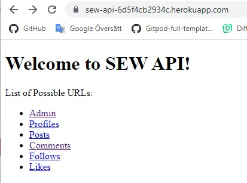
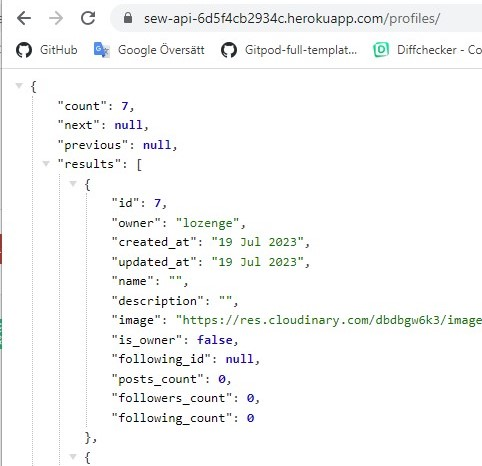
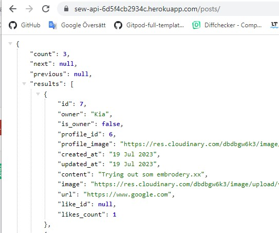
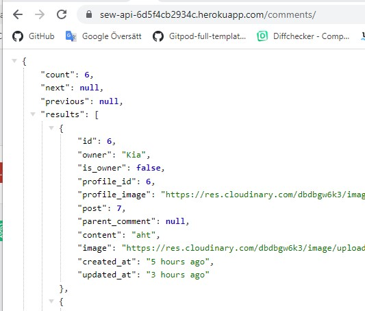
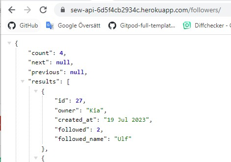
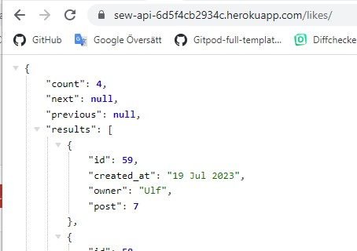

# Sew API
#### [View the live project here](https://sew-api-6d5f4cb2934c.herokuapp.com/)
Welcome to Sew API this is the backend to Sewlot socialmedia platform.

Upon visiting 

### Project Goals

To build a API

## Features
Store a J.son array of all data.
## 

###  Profiles
## 

### Posts
## 

### Comments
## 

### Followers
## 

###  Likes
## 

###  Admin panel
In Django admin panel, admin can manage profiles, posts, comments, followers and likes.

## Data Model
This project includes two custom models, Posts and Comments.

## Technologies
- Python

Frameworks, Libraries and Programs Used:
- Django rest frameworks

## Testing

### Manual testing
|Input              |Expected response                     |Results |
|----------------|-------------------------------|-----------------------------|
|**Profiles** | | |
|- Adding a profile in API |Views the profile in the API view |Pass |
|- Adding a profile in API|Makes the profile possible to sign in to Sewlot |Pass |
|- Adding a profile in Sewlot |Saves the profile in the API/Database |Pass |
| | | |
|**Post** | | |
|- Adding a post in API |Views the post in the API view |Pass |
|- Adding a post in API |Makes the post view in Sewlot |Pass |
|- Adding a post in Sewlot |Saves the post in the API/Database |Pass |
|- Removing a post in Sewlot |Removes the post in API/Database|Pass |
| | | |
|**Comments** | | |
|- Adding a Comment in API |Views the Comment in the API view |Pass |
| | | |
|**Follows** | | |
|- Adding a Follow in API |Views the Follow in the API view |Pass |
|- Adding a Follow in API |Makes the Follow view in Sewlot |Pass |
|- Adding a Follow in Sewlot |Saves the Follow in the API/Database |Pass |
|- Removing a Follow in Sewlot |Removes the Follow from the API/Database |Pass |
| | | |
|**Likes** | | |
|- Adding a Like in API |Views the Likes in the API view |Pass |
|- Adding a Like in API |Makes the Likes view in Sewlot |Pass |
|- Adding a Like in Sewlot |Saves the Likes from the API/Database |Pass |
|- Removing a Like in Sewlot |Removes the Likes from the API/Database |Pass |
| | | |

## Deployment
 **How you set up GitHub** 

Create a [fork of the repository.](https://docs.github.com/en/get-started/quickstart/fork-a-repo#forking-a-repository)

1. Log in to GitHub and go to repository: [LinnSilver/sew_api](https://github.com/LinnSilver/sew_api/tree/9dd6fe7b3c736ed35f27d22643fbd1469f1de46d)
2. Click button fork -Create a new fork.
3. Choose repository name.
4. Click Create fork.

Now you have a fork of the repository in your repository. To access code:
 
5. In your new repository:
6. Click green button: Code arrow down.
7. Choose: Create codespace on main - Code is opened in a web codespace.

After this, you do not have the files in the repository locally on your computer.
To save a copy locally on your computer:
 
9. On GitHub.com, navigate to your fork of the repository.
10. Above the list of files, click Code, Local.
11. Copy the URL for the repository.
12. Open Git Bash.
13. Change the current working directory to the location where you want the cloned directory.
14. Type  `git clone`, and then paste the URL you copied earlier.
15. Press Enter. Your local clone will be created.

It's important to commit and push correctly. Read more here:
- [How to Commit and push code from local file system to GitHub Pages.](https://docs.github.com/en/desktop/contributing-and-collaborating-using-github-desktop/making-changes-in-a-branch/committing-and-reviewing-changes-to-your-project)

After every change in the code, it's important to redo the test section. Go through:
- Python Linter
- Manual testing

 **How to set up Heroku** 
1.   Log in on Heroku.
2.  Click: Show next steps.
3.  Click: Create new app.
4.  Fill in App name and choose a region. Click: Create app.

5. Under **Settings,** choose Deployment method GitHub.
6. Click: Add Buildpack
7. Choose heroku/python. Click: Save
8. Click: Add Buildpack
9. Choose heroku/nodejs. Click: Save

11. Set up config Vars 

12.  Under **Deploy,** choose Deployment method GitHub.
13.  **Search for a repository to connect to,**  choose repo name LinnSilver/[sew_api](https://github.com/LinnSilver/sewlot-pj5/tree/8ab6a35863ac628032f8a96f55c39c329f15c8df).
14.  Click: Deploy Branch.

## Credits
### Content
All content was written by the developer. Some of the code is inspierd or coppyed from the walktrue.